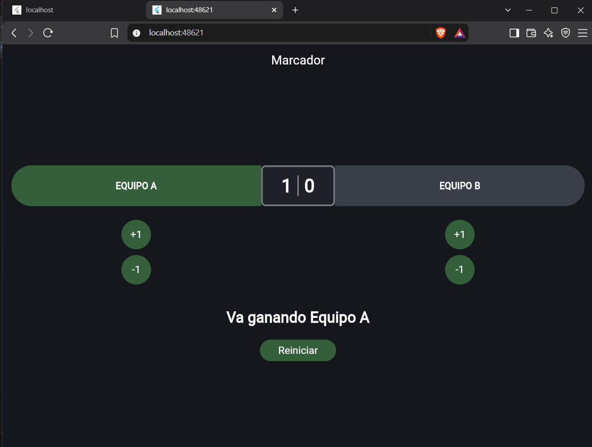
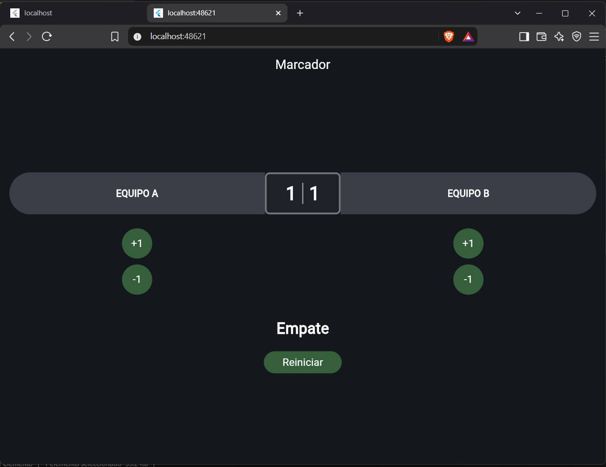

¿Qué hace setState cuando presiona un botón y qué ocurriría si cambia los
puntos sin llamarlo?
Le indica a Flutter que el estado cambió y que debe volver a cargar la interfaz para mostrar los nuevos cambios. Si no se utiliza entonces la pantalla no se actualiza hasta que se vuelva a correr de cero
